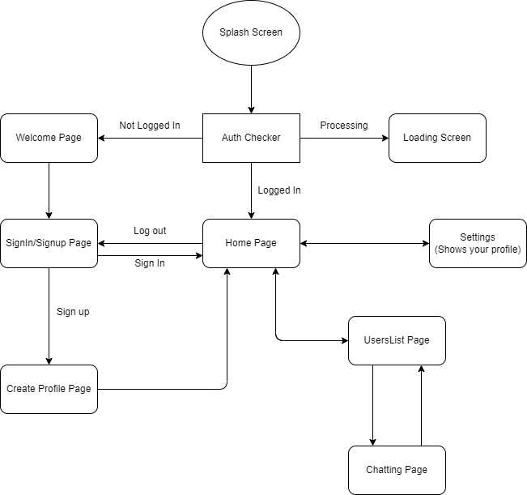
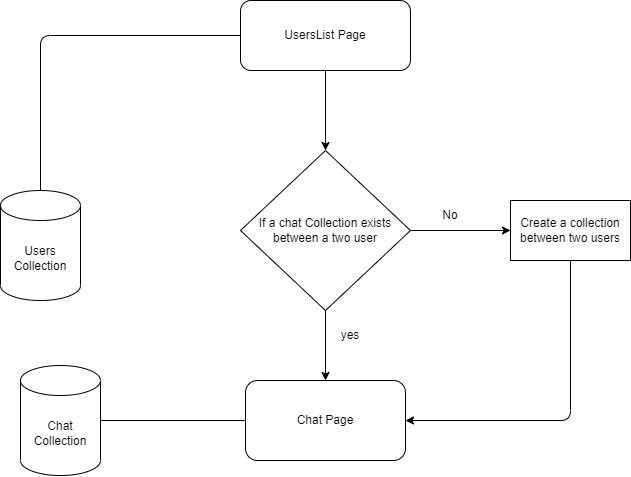

## File Structure

```bash
.
├── android # android files
├── assets # assets 
│   ├── images
│   └── lottieassets       
├── ios # android files
└── lib
    ├── api 
    │   ├── auth # Client Authentication
    │   └── database # Database API
    ├── models # Custom Models
    ├── pages
    │   ├── chat
    │   ├── error
    │   ├── home
    │   ├── loadingadd read
    │   ├── login
    │   └── settings
    ├── providers 
    ├── utils # Misc tools and stuffs
    └── widgets
```
### App Flow


### Chat architecture


### Screenshots

|    |    |    |
|:-: |:-: |--- |
|    |    |    |
|    |    |     |
|    |    |    |